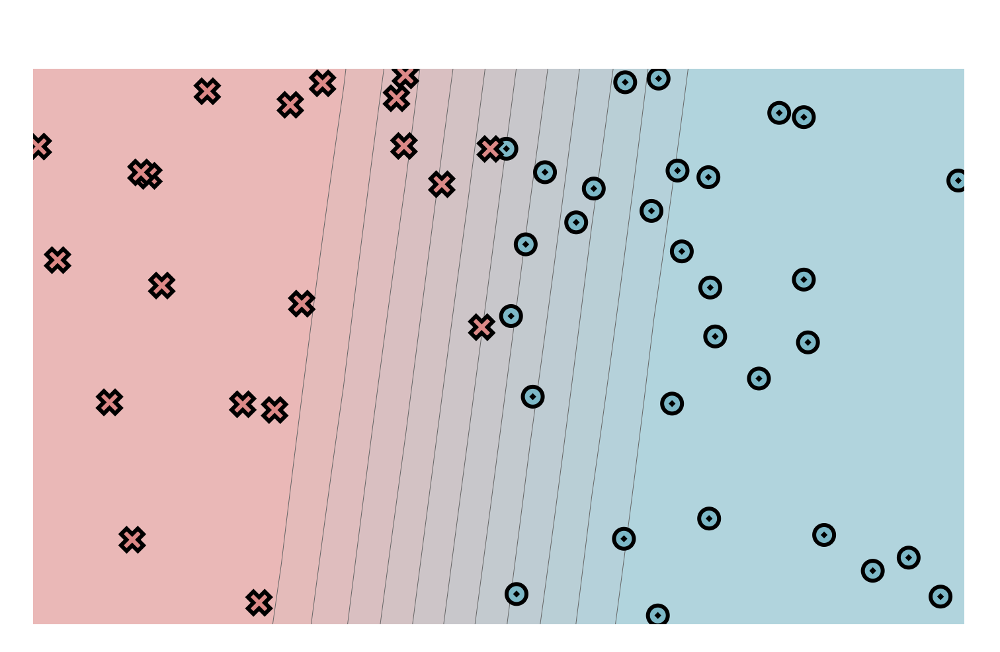
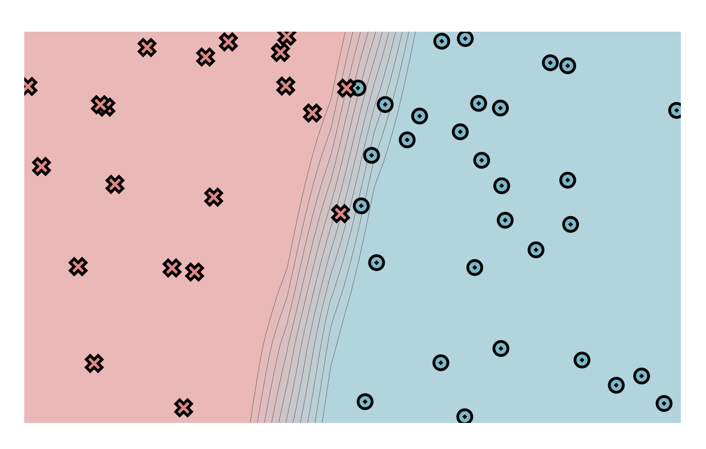
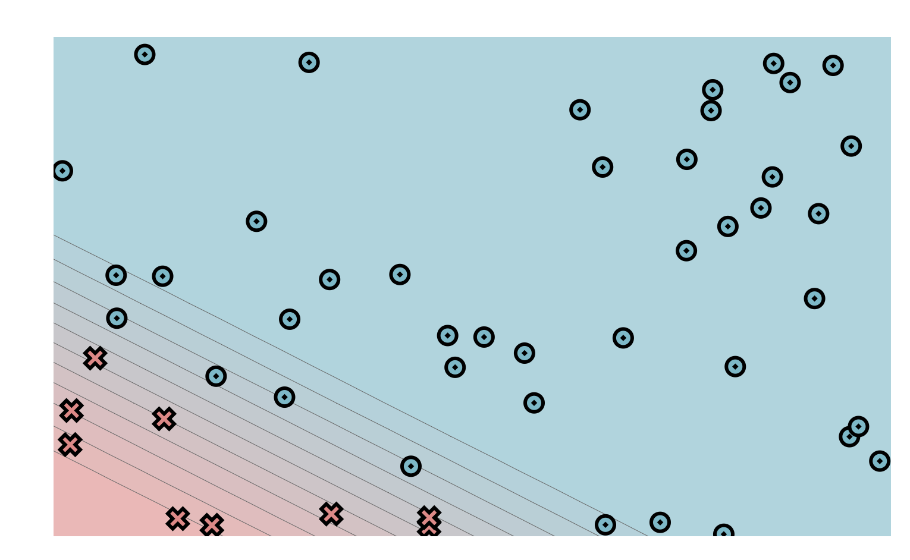
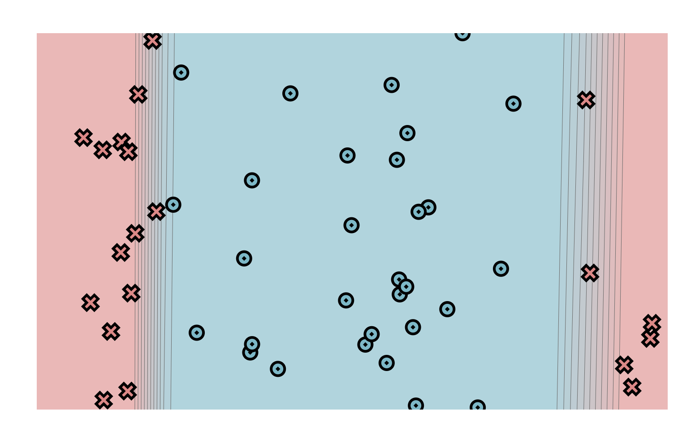
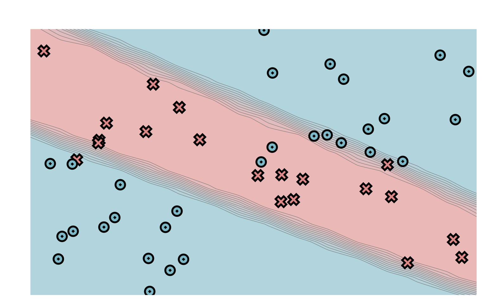

# minitorch
The full minitorch student suite. 
module 0

linear.weight_0_0 -6.4
linear.weight_1_0 0.5
linear.bias_0 2.65
module 1

Size of hidden layer 5
Learning rate 0.1
Number of epochs 500
Epoch: 10/500, loss: 34.67460199391415, correct: 24
Epoch: 20/500, loss: 30.534466986220547, correct: 37
Epoch: 30/500, loss: 28.6976927066444, correct: 31
Epoch: 40/500, loss: 27.130945729010996, correct: 35
Epoch: 50/500, loss: 25.47923009164191, correct: 37
Epoch: 60/500, loss: 23.91865445714733, correct: 39
Epoch: 70/500, loss: 22.41918659906741, correct: 40
Epoch: 80/500, loss: 21.00886723592997, correct: 40
Epoch: 90/500, loss: 19.626839910492546, correct: 44
Epoch: 100/500, loss: 18.369189059771166, correct: 45
Epoch: 110/500, loss: 17.22804213032378, correct: 46
Epoch: 120/500, loss: 16.177729660825324, correct: 47
Epoch: 130/500, loss: 15.182011269027148, correct: 47
Epoch: 140/500, loss: 14.241604117915225, correct: 47
Epoch: 150/500, loss: 13.40340600371266, correct: 47
Epoch: 160/500, loss: 12.654260996092423, correct: 48
Epoch: 170/500, loss: 11.977795413586284, correct: 48
Epoch: 180/500, loss: 11.383465258968068, correct: 48
Epoch: 190/500, loss: 10.841064517537422, correct: 48
Epoch: 200/500, loss: 10.362571350237765, correct: 48
Epoch: 210/500, loss: 9.93233223549904, correct: 48
Epoch: 220/500, loss: 9.537057970839943, correct: 48
Epoch: 230/500, loss: 9.178099214749958, correct: 48
Epoch: 240/500, loss: 8.852929152203941, correct: 48
Epoch: 250/500, loss: 8.550895602190701, correct: 48
Epoch: 260/500, loss: 8.272003997189705, correct: 48
Epoch: 270/500, loss: 8.017564503976201, correct: 48
Epoch: 280/500, loss: 7.780062913970248, correct: 48
Epoch: 290/500, loss: 7.5616761489100055, correct: 48
Epoch: 300/500, loss: 7.356517464256254, correct: 48
Epoch: 310/500, loss: 7.169079553249777, correct: 48
Epoch: 320/500, loss: 6.997644141969999, correct: 48
Epoch: 330/500, loss: 6.840061728875927, correct: 48
Epoch: 340/500, loss: 6.692496508867642, correct: 48
Epoch: 350/500, loss: 6.553645359379799, correct: 48
Epoch: 360/500, loss: 6.422713358769967, correct: 48
Epoch: 370/500, loss: 6.298996738239243, correct: 48
Epoch: 380/500, loss: 6.181870473439389, correct: 49
Epoch: 390/500, loss: 6.0707780178942645, correct: 49
Epoch: 400/500, loss: 5.9652225443934075, correct: 49
Epoch: 410/500, loss: 5.864759450009655, correct: 49
Epoch: 420/500, loss: 5.768991864792895, correct: 49
Epoch: 430/500, loss: 5.6775594418928055, correct: 49
Epoch: 440/500, loss: 5.590138420683522, correct: 49
Epoch: 450/500, loss: 5.50643717059922, correct: 49
Epoch: 460/500, loss: 5.426191781179159, correct: 49
Epoch: 470/500, loss: 5.34916678503609, correct: 49
Epoch: 480/500, loss: 5.275162811564352, correct: 49
Epoch: 490/500, loss: 5.203956889464014, correct: 49
Epoch: 500/500, loss: 5.135370705747447, correct: 49

Size of hidden layer 2
Learning rate 0.05
Number of epochs 500
Epoch: 0/500, loss: 0, correct: 0
Epoch: 10/500, loss: 24.265067231326807, correct: 41
Epoch: 20/500, loss: 23.330963769429236, correct: 41
Epoch: 30/500, loss: 22.792551765324408, correct: 41
Epoch: 40/500, loss: 22.45739231492552, correct: 41
Epoch: 50/500, loss: 22.22985680470936, correct: 41
Epoch: 60/500, loss: 22.058707657144428, correct: 41
Epoch: 70/500, loss: 21.915274070272574, correct: 41
Epoch: 80/500, loss: 21.7839054471771, correct: 41
Epoch: 90/500, loss: 21.65857753440674, correct: 41
Epoch: 100/500, loss: 21.536502948296132, correct: 41
Epoch: 110/500, loss: 21.40910462424544, correct: 41
Epoch: 120/500, loss: 21.27393476980328, correct: 41
Epoch: 130/500, loss: 21.130013757629598, correct: 41
Epoch: 140/500, loss: 20.97726254014049, correct: 41
Epoch: 150/500, loss: 20.814705244326756, correct: 41
Epoch: 160/500, loss: 20.641556714383892, correct: 41
Epoch: 170/500, loss: 20.457945907647833, correct: 41
Epoch: 180/500, loss: 20.262499042145652, correct: 41
Epoch: 190/500, loss: 20.054788330290194, correct: 41
Epoch: 200/500, loss: 19.834783454977902, correct: 41
Epoch: 210/500, loss: 19.601791027222266, correct: 41
Epoch: 220/500, loss: 19.354951572830924, correct: 41
Epoch: 230/500, loss: 19.094003003540745, correct: 41
Epoch: 240/500, loss: 18.818094912277612, correct: 41
Epoch: 250/500, loss: 18.526734375195993, correct: 41
Epoch: 260/500, loss: 18.219632118623874, correct: 41
Epoch: 270/500, loss: 17.896945832347885, correct: 41
Epoch: 280/500, loss: 17.55933760191387, correct: 41
Epoch: 290/500, loss: 17.206872700177154, correct: 41
Epoch: 300/500, loss: 16.840673757296024, correct: 41
Epoch: 310/500, loss: 16.461700124769845, correct: 41
Epoch: 320/500, loss: 16.071687474788586, correct: 41
Epoch: 330/500, loss: 15.671474903117923, correct: 41
Epoch: 340/500, loss: 15.263102361047453, correct: 41
Epoch: 350/500, loss: 14.84759557582968, correct: 41
Epoch: 360/500, loss: 14.426614118703853, correct: 41
Epoch: 370/500, loss: 14.002060585636503, correct: 41
Epoch: 380/500, loss: 13.57707527356479, correct: 41
Epoch: 390/500, loss: 13.154847387284414, correct: 43
Epoch: 400/500, loss: 12.73602292410186, correct: 44
Epoch: 410/500, loss: 12.322638371451887, correct: 44
Epoch: 420/500, loss: 11.916812975609522, correct: 44
Epoch: 430/500, loss: 11.51952274266781, correct: 45
Epoch: 440/500, loss: 11.133439158349113, correct: 45
Epoch: 450/500, loss: 10.759230424027443, correct: 45
Epoch: 460/500, loss: 10.396465991270636, correct: 45
Epoch: 470/500, loss: 10.045724282324098, correct: 46
Epoch: 480/500, loss: 9.707580280479501, correct: 46
Epoch: 490/500, loss: 9.38243929206212, correct: 47
Epoch: 500/500, loss: 9.070632206413697, correct: 47

Size of hidden layer 5
Learning rate 0.5
Number of epochs 500
Epoch: 0/700, loss: 0, correct: 0
Epoch: 10/500, loss: 29.91980629467306, correct: 42
Epoch: 20/500, loss: 28.71890953840402, correct: 42
Epoch: 30/500, loss: 27.630026771894507, correct: 41
Epoch: 40/500, loss: 26.611401386791147, correct: 41
Epoch: 50/500, loss: 25.480322884421586, correct: 41
Epoch: 60/500, loss: 24.361456537643257, correct: 41
Epoch: 70/500, loss: 23.250248468014533, correct: 41
Epoch: 80/500, loss: 22.288496643725342, correct: 41
Epoch: 90/500, loss: 21.13358081595034, correct: 41
Epoch: 100/500, loss: 19.705092062886504, correct: 41
Epoch: 110/500, loss: 18.2067149917606, correct: 41
Epoch: 120/500, loss: 18.60980606589428, correct: 41
Epoch: 130/500, loss: 16.080779490742067, correct: 41
Epoch: 140/500, loss: 21.1796856070711, correct: 41
Epoch: 150/500, loss: 15.004239287133894, correct: 41
Epoch: 160/500, loss: 13.57321380336344, correct: 42
Epoch: 170/500, loss: 15.27978800618212, correct: 41
Epoch: 180/500, loss: 13.606576625657945, correct: 41
Epoch: 190/500, loss: 12.368873785932552, correct: 45
Epoch: 200/500, loss: 13.283008149819238, correct: 43
Epoch: 210/500, loss: 12.818215325489977, correct: 45
Epoch: 220/500, loss: 12.156236015531253, correct: 47
Epoch: 230/500, loss: 12.071215665563052, correct: 45
Epoch: 240/500, loss: 11.684387736118174, correct: 47
Epoch: 250/500, loss: 13.984115442281258, correct: 42
Epoch: 260/500, loss: 11.348423511737526, correct: 47
Epoch: 270/500, loss: 10.13533171665497, correct: 47
Epoch: 280/500, loss: 9.308434655517964, correct: 46
Epoch: 290/500, loss: 10.561753950318844, correct: 47
Epoch: 300/500, loss: 9.359424229876359, correct: 48
Epoch: 310/500, loss: 8.483340776760112, correct: 47
Epoch: 320/500, loss: 8.92529460441905, correct: 48
Epoch: 330/500, loss: 12.743465653529263, correct: 44
Epoch: 340/500, loss: 9.710041766759087, correct: 47
Epoch: 350/500, loss: 9.478328028018007, correct: 47
Epoch: 360/500, loss: 9.247407595341386, correct: 48
Epoch: 370/500, loss: 9.072692637324918, correct: 48
Epoch: 380/500, loss: 8.893622297071005, correct: 48
Epoch: 390/500, loss: 8.74688781209446, correct: 48
Epoch: 400/500, loss: 8.599864836289672, correct: 48
Epoch: 410/500, loss: 8.455865841523165, correct: 48
Epoch: 420/500, loss: 8.31806684540779, correct: 48
Epoch: 430/500, loss: 8.180939079483196, correct: 48
Epoch: 440/500, loss: 7.93535426206427, correct: 48
Epoch: 450/500, loss: 7.566258246451867, correct: 48
Epoch: 460/500, loss: 7.261049636469465, correct: 48
Epoch: 470/500, loss: 6.980010252299562, correct: 48
Epoch: 480/500, loss: 6.70985237056239, correct: 48
Epoch: 490/500, loss: 6.454384857195431, correct: 48
Epoch: 500/500, loss: 6.220112123236307, correct: 48

Size of hidden layer 5
Learning rate 0.1
Number of epochs 2000
Epoch: 0/2000, loss: 0, correct: 0
Epoch: 10/2000, loss: 32.65925726877192, correct: 30
Epoch: 20/2000, loss: 32.56003549168642, correct: 30
Epoch: 30/2000, loss: 32.46207714166388, correct: 30
Epoch: 40/2000, loss: 32.358128597753144, correct: 30
Epoch: 50/2000, loss: 32.24816074686667, correct: 30
Epoch: 60/2000, loss: 32.131052790193216, correct: 30
Epoch: 70/2000, loss: 32.0068597197469, correct: 30
Epoch: 80/2000, loss: 31.8746067932502, correct: 30
Epoch: 90/2000, loss: 31.733547664725346, correct: 30
Epoch: 100/2000, loss: 31.581393442718046, correct: 30
Epoch: 110/2000, loss: 31.41869365873172, correct: 30
Epoch: 120/2000, loss: 31.243827583377428, correct: 30
Epoch: 130/2000, loss: 31.05625638271625, correct: 30
Epoch: 140/2000, loss: 30.853545640805404, correct: 30
Epoch: 150/2000, loss: 30.63542980621203, correct: 31
Epoch: 160/2000, loss: 30.400778049648633, correct: 31
Epoch: 170/2000, loss: 30.147212082874805, correct: 32
Epoch: 180/2000, loss: 29.874921773714423, correct: 33
Epoch: 190/2000, loss: 29.582210553682376, correct: 33
Epoch: 200/2000, loss: 29.268575167966883, correct: 33
Epoch: 210/2000, loss: 28.933996204043257, correct: 35
Epoch: 220/2000, loss: 28.577771613418072, correct: 38
Epoch: 230/2000, loss: 28.19742747706888, correct: 37
Epoch: 240/2000, loss: 27.793457623946182, correct: 38
Epoch: 250/2000, loss: 27.367154075525313, correct: 38
Epoch: 260/2000, loss: 26.91846896057908, correct: 40
Epoch: 270/2000, loss: 26.445835336086795, correct: 41
Epoch: 280/2000, loss: 25.95125257206765, correct: 41
Epoch: 290/2000, loss: 25.43728669001445, correct: 41
Epoch: 300/2000, loss: 24.90392761087692, correct: 41
Epoch: 310/2000, loss: 24.35720949779024, correct: 41
Epoch: 320/2000, loss: 23.795736567004347, correct: 42
Epoch: 330/2000, loss: 23.222612217721874, correct: 43
Epoch: 340/2000, loss: 22.647749972200366, correct: 43
Epoch: 350/2000, loss: 22.071551007920004, correct: 44
Epoch: 360/2000, loss: 21.499532992413148, correct: 45
Epoch: 370/2000, loss: 20.935926834097543, correct: 46
Epoch: 380/2000, loss: 20.38370933668737, correct: 46
Epoch: 390/2000, loss: 19.845693098479984, correct: 46
Epoch: 400/2000, loss: 19.32458253289244, correct: 46
Epoch: 410/2000, loss: 18.822702556716056, correct: 46
Epoch: 420/2000, loss: 18.34193211161109, correct: 46
Epoch: 430/2000, loss: 17.883671915763795, correct: 46
Epoch: 440/2000, loss: 17.44884309583146, correct: 46
Epoch: 450/2000, loss: 17.037911798164412, correct: 46
Epoch: 460/2000, loss: 16.65093352090159, correct: 46
Epoch: 470/2000, loss: 16.287685649194824, correct: 46
Epoch: 480/2000, loss: 16.230227275647408, correct: 45
Epoch: 490/2000, loss: 18.890572510706928, correct: 39
Epoch: 500/2000, loss: 24.021785598535388, correct: 36
Epoch: 510/2000, loss: 18.475735585554677, correct: 40
Epoch: 520/2000, loss: 17.87139640768399, correct: 42
Epoch: 530/2000, loss: 16.19536214076178, correct: 43
Epoch: 540/2000, loss: 16.361483065309276, correct: 44
Epoch: 550/2000, loss: 16.949864146246505, correct: 43
Epoch: 560/2000, loss: 16.10534437609923, correct: 44
Epoch: 570/2000, loss: 14.092974095523601, correct: 46
Epoch: 580/2000, loss: 13.864509929398007, correct: 46
Epoch: 590/2000, loss: 13.785751721116918, correct: 46
Epoch: 600/2000, loss: 13.43550711094019, correct: 46
Epoch: 610/2000, loss: 13.281404226946705, correct: 46
Epoch: 620/2000, loss: 13.172223239703479, correct: 46
Epoch: 630/2000, loss: 13.099399813799524, correct: 46
Epoch: 640/2000, loss: 13.165040325618632, correct: 46
Epoch: 650/2000, loss: 12.766561090425395, correct: 46
Epoch: 660/2000, loss: 12.867432765981766, correct: 46
Epoch: 670/2000, loss: 12.78412759695275, correct: 46
Epoch: 680/2000, loss: 12.703857085135477, correct: 46
Epoch: 690/2000, loss: 12.642536787721944, correct: 46
Epoch: 700/2000, loss: 12.554465961066002, correct: 46
Epoch: 710/2000, loss: 12.508646094551542, correct: 46
Epoch: 720/2000, loss: 12.482793756729016, correct: 46
Epoch: 730/2000, loss: 12.462285252424325, correct: 46
Epoch: 740/2000, loss: 12.256978531999783, correct: 46
Epoch: 750/2000, loss: 12.066731835997896, correct: 46
Epoch: 760/2000, loss: 12.627997739676653, correct: 45
Epoch: 770/2000, loss: 11.945354497074149, correct: 46
Epoch: 780/2000, loss: 12.59497021220087, correct: 45
Epoch: 790/2000, loss: 12.071886494680312, correct: 46
Epoch: 800/2000, loss: 11.964844861280724, correct: 46
Epoch: 810/2000, loss: 11.926893244222718, correct: 46
Epoch: 820/2000, loss: 11.899133331969574, correct: 46
Epoch: 830/2000, loss: 11.89248525596466, correct: 46
Epoch: 840/2000, loss: 11.61346628742934, correct: 46
Epoch: 850/2000, loss: 11.650784433384272, correct: 46
Epoch: 860/2000, loss: 12.006263711117883, correct: 46
Epoch: 870/2000, loss: 11.669370024322273, correct: 46
Epoch: 880/2000, loss: 11.533872304324234, correct: 46
Epoch: 890/2000, loss: 11.458214649251705, correct: 46
Epoch: 900/2000, loss: 11.727327641241983, correct: 46
Epoch: 910/2000, loss: 11.445574812381972, correct: 46
Epoch: 920/2000, loss: 11.391393299093005, correct: 46
Epoch: 930/2000, loss: 11.841127004732698, correct: 46
Epoch: 940/2000, loss: 11.303091013489954, correct: 46
Epoch: 950/2000, loss: 11.78361260916895, correct: 45
Epoch: 960/2000, loss: 11.523768987695133, correct: 46
Epoch: 970/2000, loss: 11.45396254383713, correct: 46
Epoch: 980/2000, loss: 11.254491764499999, correct: 46
Epoch: 990/2000, loss: 11.263666147993398, correct: 46
Epoch: 1000/2000, loss: 11.166953722100496, correct: 46
Epoch: 1010/2000, loss: 11.72304732282536, correct: 46
Epoch: 1020/2000, loss: 11.223982028053696, correct: 46
Epoch: 1030/2000, loss: 11.124257101622607, correct: 46
Epoch: 1040/2000, loss: 11.070682347222068, correct: 46
Epoch: 1050/2000, loss: 11.627399438484625, correct: 46
Epoch: 1060/2000, loss: 11.03271948685682, correct: 46
Epoch: 1070/2000, loss: 11.205532731740181, correct: 46
Epoch: 1080/2000, loss: 11.241182880512074, correct: 46
Epoch: 1090/2000, loss: 11.24982177888651, correct: 46
Epoch: 1100/2000, loss: 10.949616436181357, correct: 46
Epoch: 1110/2000, loss: 11.38164368388164, correct: 46
Epoch: 1120/2000, loss: 11.112256421286277, correct: 46
Epoch: 1130/2000, loss: 11.224941170982579, correct: 46
Epoch: 1140/2000, loss: 10.898658765939896, correct: 46
Epoch: 1150/2000, loss: 10.91947579121938, correct: 46
Epoch: 1160/2000, loss: 11.027441747775391, correct: 46
Epoch: 1170/2000, loss: 11.051408777468264, correct: 46
Epoch: 1180/2000, loss: 10.840544567293366, correct: 46
Epoch: 1190/2000, loss: 11.000320358132777, correct: 46
Epoch: 1200/2000, loss: 10.807798658023911, correct: 46
Epoch: 1210/2000, loss: 10.841088507841421, correct: 46
Epoch: 1220/2000, loss: 10.769326902975124, correct: 46
Epoch: 1230/2000, loss: 10.766716326700102, correct: 46
Epoch: 1240/2000, loss: 11.81165439651925, correct: 46
Epoch: 1250/2000, loss: 10.860297340892753, correct: 46
Epoch: 1260/2000, loss: 10.806968666389034, correct: 46
Epoch: 1270/2000, loss: 10.79678582328965, correct: 46
Epoch: 1280/2000, loss: 10.786729939593586, correct: 46
Epoch: 1290/2000, loss: 10.76903471082274, correct: 46
Epoch: 1300/2000, loss: 10.75783727421247, correct: 46
Epoch: 1310/2000, loss: 10.740744449106744, correct: 46
Epoch: 1320/2000, loss: 10.724305116950148, correct: 46
Epoch: 1330/2000, loss: 10.696742802507677, correct: 46
Epoch: 1340/2000, loss: 10.705677273021417, correct: 46
Epoch: 1350/2000, loss: 10.682765017913933, correct: 46
Epoch: 1360/2000, loss: 10.682963286657147, correct: 46
Epoch: 1370/2000, loss: 10.661953770998883, correct: 46
Epoch: 1380/2000, loss: 10.645812009541848, correct: 46
Epoch: 1390/2000, loss: 10.646182808995425, correct: 46
Epoch: 1400/2000, loss: 10.603302619702545, correct: 46
Epoch: 1410/2000, loss: 10.629305462029121, correct: 46
Epoch: 1420/2000, loss: 10.558671315086222, correct: 46
Epoch: 1430/2000, loss: 10.629377333750481, correct: 46
Epoch: 1440/2000, loss: 10.62049067128844, correct: 46
Epoch: 1450/2000, loss: 10.59222809085921, correct: 46
Epoch: 1460/2000, loss: 10.58192034049358, correct: 46
Epoch: 1470/2000, loss: 10.578976029182014, correct: 46
Epoch: 1480/2000, loss: 10.564619211383203, correct: 46
Epoch: 1490/2000, loss: 10.557313543938939, correct: 46
Epoch: 1500/2000, loss: 10.49100529799228, correct: 46
Epoch: 1510/2000, loss: 10.558576691781955, correct: 46
Epoch: 1520/2000, loss: 10.585436164757114, correct: 46
Epoch: 1530/2000, loss: 10.43583016979254, correct: 46
Epoch: 1540/2000, loss: 10.399083982104095, correct: 46
Epoch: 1550/2000, loss: 10.374504933760994, correct: 46
Epoch: 1560/2000, loss: 10.355078067775207, correct: 46
Epoch: 1570/2000, loss: 10.338148900915085, correct: 46
Epoch: 1580/2000, loss: 10.324442048843842, correct: 46
Epoch: 1590/2000, loss: 10.308092245259504, correct: 46
Epoch: 1600/2000, loss: 10.292633613046602, correct: 46
Epoch: 1610/2000, loss: 10.279544036429774, correct: 46
Epoch: 1620/2000, loss: 10.267606214006605, correct: 46
Epoch: 1630/2000, loss: 11.09737090095124, correct: 46
Epoch: 1640/2000, loss: 14.909147127302015, correct: 43
Epoch: 1650/2000, loss: 10.732024848431838, correct: 46
Epoch: 1660/2000, loss: 10.237045953120857, correct: 46
Epoch: 1670/2000, loss: 10.204480510903515, correct: 46
Epoch: 1680/2000, loss: 10.414923231830851, correct: 46
Epoch: 1690/2000, loss: 10.210510760547779, correct: 46
Epoch: 1700/2000, loss: 10.240557152258875, correct: 46
Epoch: 1710/2000, loss: 16.723996541284517, correct: 42
Epoch: 1720/2000, loss: 15.83513048218771, correct: 43
Epoch: 1730/2000, loss: 10.368731111175244, correct: 46
Epoch: 1740/2000, loss: 10.471808709215347, correct: 46
Epoch: 1750/2000, loss: 10.530303128631896, correct: 46
Epoch: 1760/2000, loss: 10.560723902255281, correct: 46
Epoch: 1770/2000, loss: 10.590286066613231, correct: 46
Epoch: 1780/2000, loss: 10.603345777443348, correct: 46
Epoch: 1790/2000, loss: 10.608488211318704, correct: 46
Epoch: 1800/2000, loss: 10.61312980870188, correct: 46
Epoch: 1810/2000, loss: 10.617191668409706, correct: 46
Epoch: 1820/2000, loss: 10.620683611791748, correct: 46
Epoch: 1830/2000, loss: 10.62366454496899, correct: 46
Epoch: 1840/2000, loss: 10.62620524352887, correct: 46
Epoch: 1850/2000, loss: 10.621963285903709, correct: 46
Epoch: 1860/2000, loss: 11.990055967685414, correct: 45
Epoch: 1870/2000, loss: 10.91304050699868, correct: 46
Epoch: 1880/2000, loss: 10.876118742727868, correct: 46
Epoch: 1890/2000, loss: 10.844035955743362, correct: 46
Epoch: 1900/2000, loss: 10.81524704992509, correct: 46
Epoch: 1910/2000, loss: 10.792936680164903, correct: 46
Epoch: 1920/2000, loss: 10.771748749532048, correct: 46
Epoch: 1930/2000, loss: 10.751818087162293, correct: 46
Epoch: 1940/2000, loss: 10.301201129161708, correct: 46
Epoch: 1950/2000, loss: 10.28996210185742, correct: 46
Epoch: 1960/2000, loss: 10.315884288206846, correct: 46
Epoch: 1970/2000, loss: 10.347900685738065, correct: 47
Epoch: 1980/2000, loss: 10.344685387711019, correct: 47
Epoch: 1990/2000, loss: 10.341316156491501, correct: 47
Epoch: 2000/2000, loss: 10.337841999690687, correct: 47

To access the autograder: 

* Module 0: https://classroom.github.com/a/qDYKZff9
* Module 1: https://classroom.github.com/a/6TiImUiy
* Module 2: https://classroom.github.com/a/0ZHJeTA0
* Module 3: https://classroom.github.com/a/U5CMJec1
* Module 4: https://classroom.github.com/a/04QA6HZK
* Quizzes: https://classroom.github.com/a/bGcGc12k
